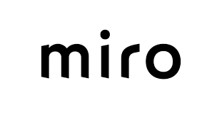

 
  

 [Sketch Cloud](https://www.sketch.com/s/29b12cf5-0b5d-4af9-aaa9-eb4a1d4fae0e)
 [Github Frontend](https://github.com/Umbrage-Studios/march-cohort-frontend)
 [Github Backend](https://github.com/Umbrage-Studios/march-cohort-backend)
 [Jira Sprint Board](https://umbrage.atlassian.net/jira/software/projects/DIBS/boards/36)
 [Miro Board/Meeting Notes](https://miro.com/app/board/uXjVO8nKJnI=/)

 
 

 
 
 
# We wanted everyone in the studio to see what we're up to so we thought we'd make an all inclusive page to give you a bird's eye view. Enjoy!

  
  

  

## UPCOMING EVENTS 

 - <mark> Sprint Demo 5/3/2022 </mark>

 - <mark> Sprint Retro 5/3/2022 </mark> 

 - <mark> Start of Sprint 2 5/4/2022 </mark>

  

Updates

  

  <a href="april29.html">4/29/22</a>
 

  
  
  

Dev

#### Stuff for Dev

  

  

Design

#### Stuff for Design

  
  
