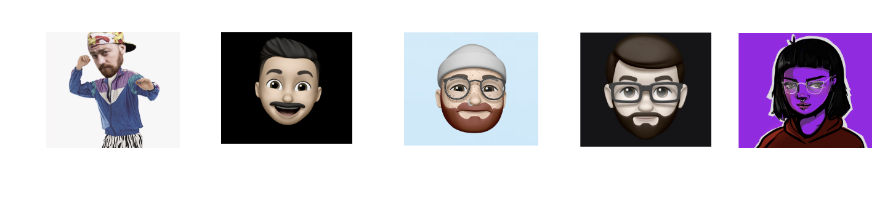

 
  

 [Sketch Cloud](https://www.sketch.com/s/29b12cf5-0b5d-4af9-aaa9-eb4a1d4fae0e)
 [Github Frontend](https://github.com/Umbrage-Studios/march-cohort-frontend)
 [Github Backend](https://github.com/Umbrage-Studios/march-cohort-backend)
 [Jira Sprint Board](https://umbrage.atlassian.net/jira/software/projects/DIBS/boards/36)
 [Miro Board/Meeting Notes](https://miro.com/app/board/uXjVO8nKJnI=/)

 
 

 
 
 
# We wanted everyone in the studio to see what we're up to so we thought we'd make an all inclusive page to give you a bird's eye view. Enjoy!

  

WHAT IS DIBS?!

<b>Umbrage as a studio will be moving into a new office space as most of you know already.  
One of the issues that has constantly been a pain point in the current space has been  
scheduling time to utilize conference rooms and conflicts around planning for room usage.  
As a group, we have been tasked with coming up with a solution to figuring out how to best  
address this issue. More specifically, we are building out a software solution that will  
give a user the ability to book a time slot for one of four rooms in the new upstairs space.  
Dibs, the name of the software we have started to build, will integrate easily with google  
calendar and give a user the ability to book a room in the Dibs application and have it  
  show up as an event in google calendar. </b>

  

 

CURRENT HIGHLIGHTS 

  - <b> Finalized Sprint 2 backlog planning with Sprint 3 almost completed </b>  &#128074;  
  - <b> Aivory and Daniel (Design) have validated all designs necessary for MVP (WOOOHOOO!) </b> &#128074;  
  - <b> Uly and Colton (Devs) are finalizing login functionality </b>   &#128074;  

  
  
 

CURRENT UPCOMING EVENTS 

 -  <b> Sprint Demo 5/3/2022 @ 2pm </b>  

 -  <b> Sprint Retro 5/3/2022 @ 2:30pm </b>  

 - <b> Start of Sprint 2 5/4/2022 </b>  

 

 

UPDATES

  
  
  
  <table style="width:100%">
  <tr>
    <th>April 29th, 2022</th>
  </tr>
  <tr>
    <td>Two days left in sprint one and things are starting to really pick up with the Dibs project. Uly and Colton   
have been hard at work with implementing the login functionality. The look of the login page and authentication  
flow is simple and easy to follow and has been coming together with very few hiccups. Daniel and Aivory have really  
stretched their design abilities and knocked it out of the park when it came to the design of the login page UI and  
contributed a massive amount to the authentication app flow. The devs are well on their way to completing all planned  
user stories and tasks. Below is a burndown chart that shows just how well Colton and Uly have been pacing themselves  
through this sprint. The grey line indicates the ideal pace or completion rate compared to outstanding work still left  
to complete. We plan to have a demo of what we have completed thus far on Tuesday of next week 5/2/2022. Everyone is  
welcome to join to check out what we accomplished for our first sprint!</td> 
  </tr>
</table>
 

  
